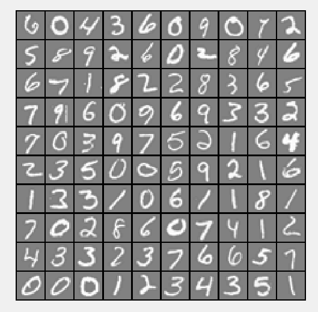
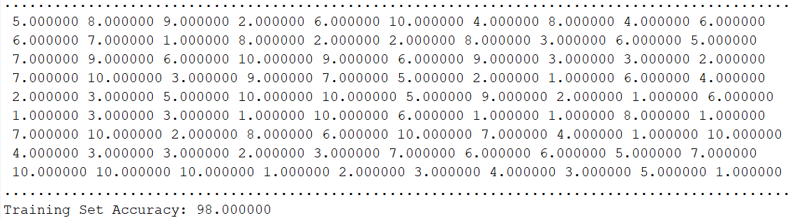

# NumberRecognition
Using Neural Networks to recognize handwritten digits (from 0 to 9).

The mapping of numbers are as follows:
```
1->1
2->2
3->3
4->4
5->5
6->6
7->7
8->8
9->9
** 0->10
```

The [program](NumberRecognition.m) first loads a 100 random digits from [data](data.mat).

For instance,this is the actual handwritten 100 examples:



The Neural Network algorithm learns from **all examples** and predicts the handwritten numbers as:



With a 98% accuracy.
